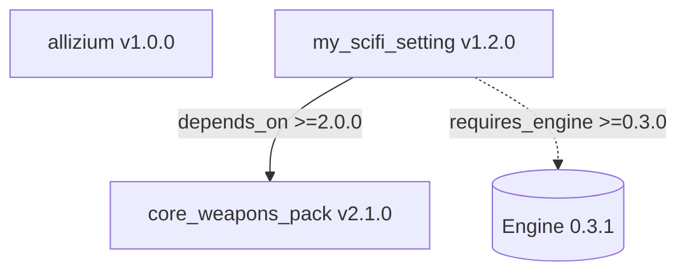

# DEPENDENCY_GRAPH.md — диаграммы зависимостей модов

Не путать с `vision/MODULES_AND_LAYERS.md`: здесь зависимости **модов** (диаграмма
по `manifest.json`), там слои и категории модулей.

Статус на 28.09.2026: спроектировано вместе с `manifest.json` /
`installed_mods.lock.json` (`docs/MODDING.md`, решение `DECISIONS.md`
#ENG-011). Реализация (сам генератор) не начата — это контракт, под
который писать скрипт.

## Главное правило

**Диаграмма — не файл проекта.** Она нигде не хранится как "текущее
состояние", не коммитится в репозиторий мода и не обновляется вручную.
Она либо генерируется по требованию, либо не существует. Единственный
источник истины — `manifest.json` каждого мода и
`installed_mods.lock.json` конкретной сборки (оба — обычный JSON,
машиночитаемый и полный).

Причина: как только диаграмма начинает жить отдельно от данных, она
рано или поздно расходится с реальностью — та же проблема дрейфа канона,
от которой построен весь Engine-слой движка, просто на уровне
инфраструктуры модов, а не игрового мира.

## Когда диаграмма реально нужна

- Игрок/моддер прислал `installed_mods.lock.json` + ошибку → нужно
  визуально показать, что от чего зависит вокруг сломанного узла.
- Кто-то собирает новый мод и хочет понять граф зависимостей перед тем,
  как объявлять `depends_on`.

Диаграмма для ИИ не нужна вообще — ИИ читает JSON напрямую, обход графа
зависимостей по данным точнее и полнее картинки. Диаграмма — только для
человека, чтобы быстро сориентироваться глазами.

## Правило масштаба: подграф, не всё сразу

При небольшом числе модов (примерно до 5–7) можно нарисовать весь граф
целиком. При большем — рисовать **только окрестность интересующего узла**:
сам мод + прямые зависимости (`depends_on`) + прямые зависящие (кто из
установленных модов зависит от него), глубина 1–2 связи. Полный граф на
100 модов — нечитаемый "клубок спагетти" что для человека, что как
картинка, и не несёт дополнительной пользы по сравнению с
отфильтрованным подграфом вокруг проблемы.

## Формат вывода

Mermaid `graph TD`, потому что рендерится нативно и в GitHub, и в
большинстве современных чатов с ИИ (в том числе в этом самом чате).
Пример желаемого результата генератора для сценария "покажи окрестность
`my_scifi_setting`":



Сплошная стрелка — зависимость между модами, пунктирная — требование к
версии движка. Узел с конфликтом версии (если `resolved` в lock-файле
не удовлетворяет `depends_on` из манифеста) должен подсвечиваться
отдельным стилем узла, чтобы ошибка была видна на диаграмме сразу, а не
только в тексте.

## Черновой контракт генератора (для будущей реализации)

Не готовый код, а описание того, что должна делать функция, когда до неё
дойдут руки:

```text
generate_diagram(lock_file_path, target_mod_id=None, depth=2) -> str
  1. Прочитать installed_mods.lock.json → список resolved-модов и их
     фактических depends_on.
  2. Если target_mod_id не задан — если модов <= 7, взять все;
     иначе потребовать target_mod_id явно (не рисовать всё молча).
  3. Если target_mod_id задан — BFS от узла на глубину `depth` в обе
     стороны графа зависимостей (кто зависит ОТ него и от кого зависит ОН).
  4. Для каждого ребра сверить требуемую версию (из manifest.json мода)
     с фактически разрешённой (из lock-файла) — пометить конфликтующие.
  5. Собрать Mermaid graph TD по правилам разметки выше.
```

## Куда это подключается

- `main.py` / будущий CLI мод-менеджера: команда вида
  `python tools/mod_graph.py --mod my_scifi_setting` печатает Mermaid
  в консоль или в файл для вставки в чат с ИИ при разборе поломки.
- Явно НЕ подключается к движку в рантайме — генерация диаграммы не
  должна быть частью игрового цикла `main.py`, это отдельная
  разработческая/саппорт-утилита.
